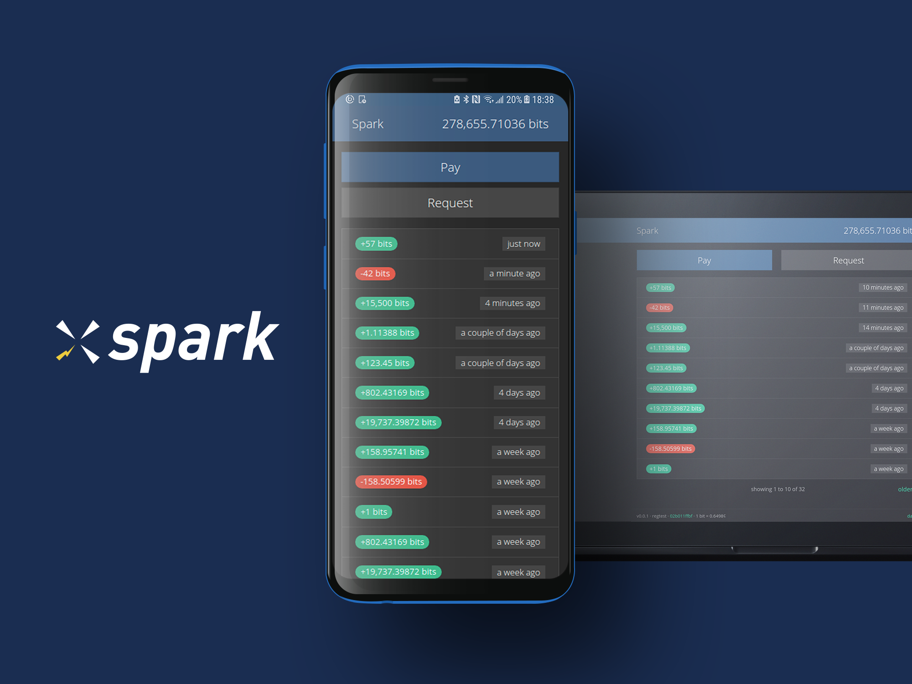
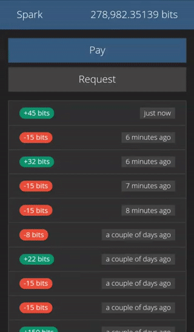
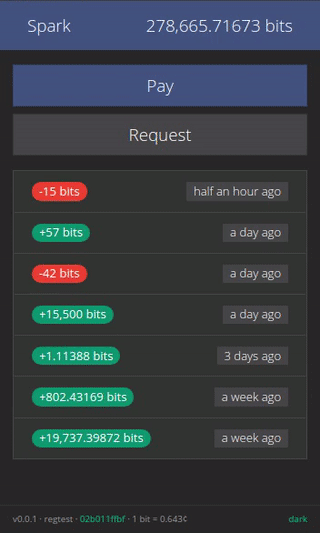

# Spark Lightning Wallet

[](https://www.npmjs.com/package/spark-wallet)
[](https://travis-ci.org/shesek/spark-wallet)
[](https://hub.docker.com/r/shesek/spark-wallet)
[](https://github.com/shesek/spark-wallet/blob/master/LICENSE)
[](http://makeapullrequest.com)
[](https://webchat.freenode.net/?channels=spark-wallet)

:zap: Simple & minimalistic
:zap: Purely off-chain
:zap: Progressive Web App
:zap: Personalizable themes
:zap: Mobile and desktop apps
:zap: Automatic self-signed TLS
:zap: LetsEncrypt integration
:zap: Tor hidden service (v3)
:zap:






## Contents

- [Introduction](#introduction)
- [Server installation](#server-installation) (for web access)
- [Desktop apps](#desktop-apps) (for Linux, macOS and Windows)
- [Mobile app](#mobile-app) (for Android, iOS coming soon)
- [Progressive Web App](#progressive-web-app)
- [GUI settings & controls](#gui-settings--controls)
- [Browser support](#browser-support)
- [Developing](#developing)
- [Code signing & reproducible builds](#code-signing--reproducible-builds)
- [CLI options](#cli-options)

## Introduction

Spark is a minimalistic wallet GUI for c-lightning, accessible over the web or
through mobile and desktop apps (for Android, Linux, macOS and Windows).
It is currently oriented for technically advanced users and is not an all-in-one package,
but rather a "remote control" interface for a c-lightning node that has to be managed separately.

Sparks supports sending and receiving payments, viewing history, and managing channels.

Spark is a purely off-chain wallet, with no on-chain payments.
This allows Spark to fully realize the awesome UX enabled by lightning,
without worrying about the complications and friction of on-chain.
This might change someday.

Spark has a responsive UI suitable for mobile, tablet and desktop devices,
but is best optimized for use on mobile.

> ⚠️ Spark is alpha-quality software under active development.
> Please use with care, preferably on testnet or with insignificant amounts.
> Spark comes with no guarantees, use at your own risk.

Big shout out to [Blockstream](https://blockstream.com) for generously sponsoring this work!

## Server installation

Requires a running [c-lightning](https://github.com/ElementsProject/lightning) node
(see setup instructions in [the official docs](https://github.com/ElementsProject/lightning/blob/master/doc/INSTALL.md)
or [this tutorial](https://hackernoon.com/harnessing-lightning-for-instant-bitcoin-transacting-a-tutorial-3b9dcdc00552))
and nodejs v6.0 or newer (nodejs v8 is recommended, see [instructions here](https://nodejs.org/en/download/package-manager/).
If you're running into permission issues,
[try this](https://docs.npmjs.com/getting-started/fixing-npm-permissions#option-two-change-npms-default-directory).)

```bash
$ npm install -g spark-wallet

$ spark-wallet # defaults: --ln-path ~/.lightning --port 9737
```

Or simply `$ npx spark-wallet`, which will install and start Spark (with the default args) in one go.

Spark will generate and print a random username and password that'll be used to login into the wallet.
To persist/load the generated credentials, set `--cookie-file <path>`.
To specify your own login credentials, set `--login [user]:[pass]` or the `LOGIN` environment variable.

To access the wallet, open `http://localhost:9737/` in your browser and login with the username/password.

See `$ spark-wallet --help` for the full list of command-line options (also available under [*CLI options*](#cli-options)).

#### Configuration file

Spark reads configuration options from `~/.spark-wallet/config` (can be overridden with `--config/-c <path>`).
The expected format is one `key=value` per line, like so:

```ini
ln-path=/data/lightning/testnet
login=bob:superSecretPassword
port=8000
```

#### Connecting remotely

To accept remote connections, set `--host <listen-address>` (shorthand `-i`, e.g. `-i 0.0.0.0`).
This will automatically enable TLS with a self-signed certificate.

For more information on TLS, instructions for setting up a CA-signed certificate using the built-in LetsEncrypt integration
and for adding the self-signed certificate to Android,
see [`doc/tls.md`](doc/tls.md).

To start Spark as a Tor hidden service, set `--onion`. You don't need Tor pre-installed for this to work.
See [`doc/onion.md`](doc/onion.md) for more details,
the advantages of using an hidden service, and instructions for connecting from Android.
*This is highly recommended.*

#### Deploy with Docker

Spark is also available as a Docker image that comes bundled with bitcoind and c-lightning.
See [`doc/docker.md`](doc/docker.md) for details.

#### Adding to startup with `systemd`

See [`doc/startup-systemd.md`](doc/startup-systemd.md).

## Desktop apps

Electron-based desktop apps for Linux (packaged as `deb`, `AppImage`, `snap` and `tar.gz`),
macOS (as `zip`) and Windows (installer and a portable) are available for download from the
[releases page](https://github.com/shesek/spark-wallet/releases).

The desktop apps comes bundled with the Spark server-side component. If you're connecting to a local
c-lightning instance, you [can configure](https://user-images.githubusercontent.com/877904/44618385-68f40100-a87d-11e8-891b-79a0f2d59751.png)
the desktop app to connect to it directly without manually setting up the Spark server.

Connecting to a remote c-lightning instance requires setting up the Spark server on the same machine
running c-lightning and connecting through it.

## Mobile app

A Cordova-based native app for Android is available for download from the
[Google Play app store](https://play.google.com/store/apps/details?id=com.spark.wallet)
or from the [releases page](https://github.com/shesek/spark-wallet/releases).

The app requires a Spark server to communicate with, which you need [to setup](#server-installation) as a prerequisite.

When the app starts for the first time, you'll need to configure your Spark server URL and API access key.
You can print your access key to the console by starting Spark with `--print-key/-k`.
You can also scan this information from a QR, which you can get with `--pairing-qr/-Q`.

For the native app to properly communicate with the server, the TLS certificate has to be
[signed by a CA](doc/tls.md#letsencrypt-integration)
or manually [added as a user trusted certificate](doc/tls.md#add-as-trusted-certificate-to-android).

## Progressive Web App

You can install Spark as a [PWA](https://developer.mozilla.org/en-US/Apps/Progressive) (on mobile and desktop) to get a more native-app-like experience,
including an home launcher that opens up in full screen, system notifications and faster load times.

Available in Chrome mobile under `⋮` -> `Add to homescreen` ([see here](https://imgur.com/zVe1sOH)),
in Chrome desktop under `More tools` -> `Install to desktop` ([see here](https://i.imgur.com/Pj6FpGA.png))
and in Firefox mobile with an icon next to the address bar ([see here](https://mdn.mozillademos.org/files/15762/add-to-home-screen-icon.png)).

Installing the PWA requires TLS and a [CA-signed certificate](doc/tls.md#letsencrypt-integration)
(unless accessed via `localhost`).

Compared to the PWA, the main advantages of the mobile and desktop apps are
the ability to handle `lightning:` URIs,
better security sandbox (detached from the browser)
and static client-side code.

**Note for iOS users:** iOS [does](https://github.com/webrtc/samples/issues/933) [not](https://stackoverflow.com/questions/46228218/how-to-access-camera-on-ios11-home-screen-web-app/46350136)
allow PWAs to use WebRTC (required for the QR scanner), but it works otherwise.
The QR scanner works if you access Spark without using the PWA "Add to homescreen" feature.



## GUI settings & controls

- **Pay** and **Request** are pretty intuitive and don't require much explaining. Try them!

- **Display unit:** Click the balance on the top-right or the unit in the "request payment" page to toggle the currency display unit.
  The available options are sat, bits, milli, btc and usd.

- **Theme switcher:** Click the theme name on the bottom-right to change themes (you can choose between 16 [bootswatch](https://bootswatch.com) themes).

- **Payment details:** Click on payments in the list to display more details.
  (note that the fee shown includes c-lightning's [overpayment randomization](https://github.com/ElementsProject/lightning/issues/1089))

- **Expert mode:** Click the version number on the bottom-left to toggle expert mode.
  This will add two new menu items, "*Logs*" and
  ["*RPC Console*"](https://user-images.githubusercontent.com/877904/44295439-7fb0bb80-a2b1-11e8-8506-f5afb1c9f1d7.png),
  and display yaml dumps with additional information throughout the app.

- **Node address:** Click the node id on the footer to open the node info page which displays your node address (as text and QR).

- **Channel management:** Click the "*Channels*" button inside the node info page to show and manage channels.

## Browser support

Supported on recent desktop and mobile version of Chrome, Firefox and Safari.
IE is unsupported.

Requires iOS 11.2+ for WebRTC (used by the QR scanner), but works otherwise with iOS 9+.
Chrome on iOS does not support WebRTC.


## Developing

Spark is written in a reactive-functional style using [rxjs](https://github.com/ReactiveX/rxjs) and [cycle.js](https://cycle.js.org),
with bootstrap for theming and a nodejs/express server as the backend.

To start a development server with live compilation for babel, browserify, pug and stylus, run:

```bash
$ git clone https://github.com/shesek/spark-wallet && cd spark-wallet
$ npm install
$ npm start -- --ln-path /data/lightning
```

Cordova builds can be prepared with `npm run dist:cordova`.
The `.apk` file will be available in `cordova/platforms/android/app/build/outputs/apk/debug/`.

Electron builds can be prepared with `npm run dist:electron`.
They will be available under `electron/dist`.

To get more verbose output in the browser developer console, set `localStorage.debug = 'spark:*'`.

See [`doc/dev-regtest-env.md`](doc/dev-regtest-env.md) for instructions setting up a regtest environment with multiple wallets.

Pull requests, suggestions and comments are welcome!

## Code signing & reproducible builds

Signed distribution checksums are available in the git repo at
[`SHA256SUMS.asc`](SHA256SUMS.asc)
(updated with every versioned release)
and on the [releases page](https://github.com/shesek/spark-wallet/releases).
Git version tags are signed too.

The releases are signed by Nadav Ivgi (@shesek).
The public key can be verified on [keybase](https://keybase.io/nadav),
[github](https://api.github.com/users/shesek/gpg_keys),
[twitter](https://twitter.com/shesek) (under bio),
[HN](https://news.ycombinator.com/user?id=nadaviv)
or on [a domain he's known to control](https://www.bitrated.com/.keys/staff/nadav.asc).

To install the signed NPM package, download it from
[the releases page](https://github.com/shesek/spark-wallet/releases), verify the hash
and install using `$ npm install -g spark-wallet-[x.y.z]-npm.tgz`.

To install the signed Docker image, get the image hash from `SHA256SUMS.asc` and install it with
`$ docker pull shesek/spark-wallet@sha256:[image-hash-verified-by-be-signed]`.

The NPM package, Android `apk` builds, Linux `tar.gz`/`snap` builds, macOS `zip` builds and Windows builds (installer and portable)
[are deterministically reproducible](doc/reproducible-builds.md).

## CLI options

```bash
$ spark-wallet --help

  A minimalistic wallet GUI for c-lightning

  Usage
    $ spark-wallet [options]

  Options
    -l, --ln-path <path>     path to c-lightning data directory [default: ~/.lightning]
    -p, --port <port>        http(s) server port [default: 9737]
    -i, --host <host>        http(s) server listen address [default: localhost]
    -u, --login <userpwd>    http basic auth login, "username:password" format [default: generate random]
    -C, --cookie-file <path> persist generated login credentials to <path> or load them [default: none]

    --force-tls              enable TLS even when binding on localhost [default: enable for non-localhost only]
    --no-tls                 disable TLS for non-localhost hosts [default: false]
    --tls-path <path>        directory to read/store key.pem and cert.pem for TLS [default: ~/.spark-wallet/tls/]
    --tls-name <name>        common name for the TLS cert [default: {host}]

    --letsencrypt <email>    enable CA-signed certificate via LetsEncrypt [default: false]
    --le-port <port>         port to bind LetsEncrypt verification server [default: 80]
    --le-noverify            skip starting the LetsEncrypt verification server [default: start when {letsencrypt} is set]
    --le-debug               display additional debug information for LetsEncrypt [default: false]

    -o, --onion              start Tor Hidden Service (v3) [default: false]
    -O, --onion-path <path>  directory to read/store hidden service data [default: ~/.spark-wallet/tor/]

    -k, --print-key          print access key to console (for use with the Cordova/Electron apps) [default: false]
    -q, --print-qr           print QR code with the server URL [default: false]
    -Q, --pairing-qr         print QR code with embedded access key [default: false]
    --public-url <url>       override public URL used for QR codes [default: http(s)://{host}/]</url>

    --no-webui               run API server without serving client assets [default: false]
    --no-test-conn           skip testing access to c-lightning rpc (useful for init scripts) [default: false]

    -c, --config <path>      path to config file [default: ~/.spark-wallet/config]
    -V, --verbose            display debugging information [default: false]
    -h, --help               output usage information
    -v, --version            output version number

  Example
    $ spark-wallet -l ~/.lightning

  All options may also be specified as environment variables:
    $ LN_PATH=/data/lightning PORT=8070 NO_TLS=1 spark-wallet
```

## License

[MIT](LICENSE)
